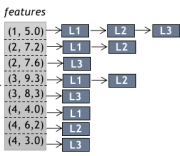
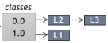
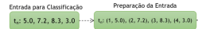
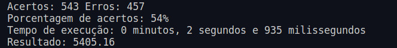
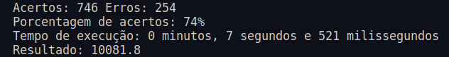
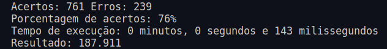

<a name="readme-topo"></a>

<h1 align='center'>
  🧮 Algoritmo de Classificação LAC
</h1>

<div align='center'>

[![SO][Ubuntu-badge]][Ubuntu-url]
[![IDE][vscode-badge]][vscode-url]
[![Make][make-badge]][make-url]
[![Linguagem][cpp-badge]][cpp-url]

Algoritmos e Estruturas de Dados I <br>
Engenharia de Computação <br>
Prof. Michel Pires da Silva <br>
CEFET-MG Campus V <br>
2024/1  
</div>

<details>
  <summary>
  <b style='font-size: 15px'>
    📑 Sumário
  </b>
  </summary>
  <ol>
    <li><a href="#-Introdução">🔍 Introdução</a></li>
    <li>
      <a href="#-Fundamentação-Teórica">💡 Fundamentação Teórica</a>
    </li>
    <li>
      <a href="#-Objetivos">🎯 Objetivos</a>
      <ul>
        <li><a href='#Objetivo-Geral'>Objetivo Geral</a></li>
        <li><a href='#Objetivos-Específicos'>Objetivos Específicos</a></li>
      </ul>
    </li>
    <li>
      <a href="#-Metodologia">🔬 Metodologia</a>
      <ul>
        <li><a href='#Arquivos'>Arquivos</a></li>
        <li><a href='#Bibliotecas'>Bibliotecas</a></li>
        <li><a href='#Funções'>Funções</a></li>
        <li><a href='#Detalhes-de-Implementação'>Detalhes de Implementação</a></li>
      </ul>
    </li>
    <li>
      <a href="#-Testes-e-Análises-dos-Resultados">📊 Testes e Análises dos Resultados</a>
    </li>
    <li><a href="#-Conclusão">🏁 Conclusão</a></li>
    <li>
      <a href="#-Começando">🔨 Começando</a>
      <ul>
        <li><a href="#Pré-requisitos">Pré-requisitos</a></li>
        <li><a href="#Instalando">Instalando</a></li>
      </ul>
    </li>
    <li><a href="#-Ambiente-de-Compilação-e-Execução">🧪 Ambiente de Compilação e Execução</a></li>
    <li><a href="#-Referências">📚 Referências</a></li>
    <li><a href="#-Contato">📨 Contato</a></li>
  </ol>
</details>

<details> 
  <summary>
    <b style='font-size: 12px'> Abstract </b>
  </summary>
  Utilizando o algoritmo de classificação LAC, este projeto busca estratégias para aprimorar seu desempenho quando aplicado à classificação do conjunto de dados PokerHand Data-Set. Através do uso de conceitos como sistema de caching de informações, otimizações de interseções, predeterminação de classificações, e tabelas hash LSH, estudamos melhores maneiras e adaptações que permitem uma melhor gestão e um controle mais eficiente das classificações feitas pelo algoritmo. Dessa forma, serão apresentados aqui os resultados provenientes de testes e estudos realizados para averiguar a eficácia da implementação dessas estratégias em conjunto com o algoritmo em questão, bem como outras abordagens adotadas com o objetivo de melhorar a performance em termos de tempo e acurácia ao realizar o procedimento. <br><br>
  🔑 <b>Keywords:</b> Lac, Classificação, PokerHand Data-Set, Caching, Otimização, Hash LSH
<br>
</details>

## 🔍 Introdução

<div align='justify'>

  Este [trabalho][trabalho-url] (Algoritmo de Classificação LAC) foi proposto na disciplina de Algoritmos e Estruturas de Dados I (AEDSI) pelo professor [Michel Pires da Silva][github-prof].

  A partir da base do algoritmo apresentado pelo Prof. Dr. Adriano Veloso em sua tese de doutorado [^1], neste projeto, iremos nos aprofundar em conceitos e práticas que visam melhorar a eficácia de tal algoritmo. O algoritmo apresentado em [^1], utiliza um conceito de treino e teste para classificar determinadas bases de dados. Primeiramente, o algoritmo busca mapear os dados a serem classificados por meio de ocorrências selecionadas, denominadas base de treino. Em seguida, ao ser apresentada a base de dados onde será feita a classificação, chamada base de teste, o algoritmo, tendo acesso às informações coletadas no treino, pode utilizar conceitos como similaridade, confiança e suporte para realizar a classificação de determinado conjunto de dados.

  Neste estudo, iremos aplicar tal algoritmo na classificação do conjunto de dados PokerHand Data-Set [^2]. Este conjunto de dados contém todas as combinações possíveis para uma mão de cinco cartas no jogo de pôquer, bem como a categoria ou classe à qual essa mão pertence. A disposição desse conjunto de dados é feita da seguinte forma: formam-se 11 colunas para cada mão a ser analisada, onde cada coluna representa uma carta ou naipe, de forma que a última coluna representa a classe à qual essa mão pertence. Para cada mão, uma série com 11 colunas (10 cartas e 1 classe), as colunas ímpares, começando por 1, representam os naipes, enquanto as colunas pares representam as cartas. Os dados são codificados da seguinte forma:

  - ***NAIPES:*** 
    - **1**- Copas, **2**- Espadas, **3**- Ouros, **4**- Paus

  - ***CARTAS:***
    - **1**- Ás, **2**- Dois, **3**- Três, **4**- Quatro, **5**- Cinco, **6**- Seis, **7**- Sete, **8**- Oito, **9**- Nove, **10**- Dez, **11**- Valete, **12**- Rainha, **13**- Rei

  - ***CLASSES:***
    - **0**- Nada em mãos, **1**- Um par, **2**- Dois pares, **3**- Trinca, **4**- Sequência, **5**- Flush, **6**- Full House, **7**- Quadra, **8**- Straight Flush, **9**- Royal Flush

  **Exemplo de representação (11D):**
  - **Dados:** 1, 11, 1, 13, 1, 10, 1, 12, 1, 1, 9
  - **Codificação:** Copas-Ás, Copas-10, Copas-Valete, Copas-Dama, Copas-Rei, Royal Flush


  Dentre todas as classes presentes em nossa base de dados, algumas aparecem com mais frequência do que outras. Por exemplo, a probabilidade de um jogador obter uma mão Royal Flush é muito menor do que obter uma mão com apenas um par. Sendo assim, a frequência de cada classe é a seguinte. 
  - **0:** Nada em mãos (49,95202%)  
  - **1:** Um par (42,37905%)
  - **2:** Dois pares (4,82207%)
  - **3:** Trinca (2,05118%)
  - **4:** Sequência (0,37185%)
  - **5:** Flush: 54 ocorrências (0,21591%)
  - **6:** Full House: 36 ocorrências (0,14394%)
  - **7:** Quadra (0,02399%)
  - **8:** Straight Flush (0,01999%)
  - **9:** Royal Flush (0,01999%)

  Todas as combinações de cartas e possíveis mãos no jogo de pôquer totalizam mais de um milhão de possibilidades. Para o treinamento de nosso algoritmo, foram selecionados 25 mil exemplos da base de dados original de forma a fornecer informações suficientes para que possamos classificar as demais amostras.

  Dessa forma, empregando a base do algoritmo LAC [^1] para realizar a classificação desta base de dados, iremos buscar meios de otimizar o procedimento de forma a aprimorar a acurácia obtida e o tempo gasto para classificar toda a base de dados.
</div>
<p align="right">(<a href="#readme-topo">voltar ao topo</a>)</p>


## 💡 Fundamentação Teórica

<div align='justify'>

Neste estudo serão utilizadas apenas as funcionalidades básicas do algoritmo LAC, apesar de sua complexidade adicional devido a várias implementações proposta pelo autor. O conceito base do algoritmo envolve o cálculo de variáveis como suporte e confiança para determinar a qual classe uma determinada sequência de dados pertence. Sendo assim, analisemos como se deu o procedimento base até a classificação final.

### 🏋️‍♂️ Fase de Treino
Durante o processo de treinamento, nosso algoritmo mapeia todas as informações fornecidas da seguinte forma: a partir da posição (coluna) em que um dado está disposto, é criado o conceito de tuplas, estruturas do tipo `<Chave, Valor>`, para mapeá-lo. Essas tuplas são formadas a partir do valor da coluna em que o dado se encontra e do valor presente na mesma. Esse processo é realizado para todas as cartas, deixando de fora as classes de cada linha.

- **Exemplo de tuplas geradas:**
  - **Dados:** [3, 3, 1, 1, 2, 3, 1]
  - **Mapeamento:** [(1, 3), (2, 3), (3, 1), (4, 1), (5, 2), (6, 3), 1]


Em conjunto com o mapeamento dos dados, são criadas tabelas invertidas responsáveis por armazenar as tuplas/features mapeadas e as linhas onde elas ocorrem. Dessa forma, são criadas estruturas `<Chave, Valor>`, onde as chaves são as tuplas/features e o valor é um array de inteiros contendo todas as linhas onde essa feature ocorre.

<div align='center'>
  
  <p>Exemplo de Tabela Invertida de Features</p>
</div>

 De maneira semelhante, é criada uma tabela invertida responsável por armazenar as classes e as linhas onde elas ocorrem, permitindo o controle sobre a qual classe cada linha do treinamento pertence.

<div align='center'>
  
  <p>Exemplo de Tabela Invertida de Classes</p>
</div>

### 🏃‍♂️ Fase de Teste
Após realizar o procedimento de treino e ter salvo em memória todas as features presentes na base utilizada, bem como as linhas nas quais elas têm recorrências, e de forma semelhante para as classes, nosso algoritmo passa para a fase de teste. Nessa etapa, é realizada finalmente a classificação de cada linha (mão de pôquer) presente na base de teste. 

Para realizar tal procedimento, nosso algoritmo executa as seguintes etapas: Primeiramente, realizamos o mapeamento dos dados de forma semelhante à fase de treino, gerando tuplas/features, estruturas do tipo `<Chave, Valor>`. Semelhante à fase de treino, essas features representam as colunas de cada valor e o valor presente em tal posição. 


<div align='center'>
  
  <p>Exemplo de Mapeamento Fase de Teste</p>
</div>

Realizado o mapeamento, acessamos na tabela invertida de features, criada na fase de treino, o array de inteiros que representa cada linha onde determinada feature aparece. Em seguida, realizamos um procedimento que realiza interseções entre os arrays provenientes de cada tupla, ou seja, comparamos quais e quantas linhas determinadas tuplas têm em comum, de forma a fazer a análise combinatória de todas as interseções possíveis. Durante esse procedimento, ao realizar as interseções entre os arrays referentes a cada tupla, calculamos o suporte e a confiança, variáveis responsáveis por classificar cada mão. Ao calcular as interseções para cada combinação de features, iteramos sobre a matriz invertida de classes, criada durante o treinamento, e, para cada classe, fazemos a interseção entre o array de inteiros que representa as linhas onde a classe aparece e o array resultante da interseção da análise combinatória das features. O nosso valor **confiança** recebe o tamanho do vetor resultante dessa interseção.

Por fim, na iteração para cada classe, para calcular o suporte, dividimos o valor da **confiança** pela quantidade de features presentes na base de dados construída durante o treinamento. Dessa forma, ao calcular o valor de suporte, este é somado em um array `resultado`, que é responsável por guardar a soma do suporte para cada classe. Após realizar todas as análises combinatórias possíveis, a classe atribuída para a mão será aquela que tiver o maior valor de suporte no array `resultado`.

Concluímos, assim, o procedimento necessário para realizar a classificação de cada mão/linha da base de dados [^2]. A seguir, veremos as otimizações propostas com o objetivo de aprimorar esse procedimento, buscando alcançar resultados mais satisfatórios em termos de tempo e acurácia, bem como a forma com a qual as mesma foram implementadas.

</div>

<p align="right">(<a href="#readme-topo">voltar ao topo</a>)</p>

## 🎯 Objetivos

<div align="justify">

  ### Objetivo Geral
  O objetivo geral deste estudo é investigar e aprimorar a eficácia do algoritmo Lazy Associative Classifier (LAC) na classificação de uma grande massa de dados, utilizando o PokerHand Data-Set como um caso de estudo [^2]. Busca-se melhorar a precisão e eficiência do processo de classificação, explorando otimizações para especificamente a fase de teste do algoritmo, buscando reduzir o tempo de execução e aumentar a acurácia das classificações realizadas.

  ### Objetivos Específicos
  - Implementar o algoritmo LAC para classificar o PokerHand Data-Set, utilizando a metodologia baseada em suporte e confiança para determinar as classes das mãos de pôquer.
  - Analisar a precisão e o desempenho do algoritmo LAC com a implementação padrão no conjunto de dados, identificando possíveis limitações ou áreas para melhoria. 
  - Desenvolver e testar técnicas de otimização que possam reduzir o tempo de execução do algoritmo sem comprometer a acurácia da classificação. 
  - Comparar os resultados obtidos após a implementação das otimizações com os resultados da implementação padrão, avaliando melhorias em termos de eficiência computacional e precisão da classificação. 
</div>

<p align="right">(<a href="#readme-topo">voltar ao topo</a>)</p>

## 🔬 Modelagem de Aplicação 

<div aling='justify'>

  Partindo do conceito apresentado acima, é possível abordar diferentes soluções para o nosso estudo. Nesta seção, apresentaremos a forma com a qual modelamos o problema, bem como as estratégias de otimização empregadas para aumentar o desempenho em termos de acurácia das classificações e tempo gasto nessa tarefa. Para implementar nossa solução, a linguagem escolhida foi C++, uma vez que esta nos oferece um paradigma procedural que demonstra ótimo desempenho ao lidar com o processamento de grandes volumes de instruções e também conta com a vantagem de ter diversas estruturas de dados implementadas que facilitam a modelagem da solução

  ### 📊 Estrutura de Dados

  Compreendendo o procedimento proposto pelo algoritmo [^1], torna-se claro que, em alguns casos, estruturas de dados primárias não são suficientes para construir uma solução ideal. Por exemplo, a construção das tabelas invertidas, tanto na fase de treino quanto na de teste. Sendo assim, torna-se mister o uso de estruturas de dados mais complexas, a fim de obter um código limpo, que mantenha a consistência com o modelo apresentado e apresente bom desempenho.

  A começar pelo exemplo citado acima, definamos como e com quais estruturas de dados foram implementadas as tabelas invertidas. Primeiramente, ao mapear as entradas de dados, antes mesmo de começar a preencher as tabelas invertidas de features e classes, utilizou-se da estrutura `pair`, apresentada em [^3]. Essa estrutura nos permite armazenar dois valores em uma única variável, estabelecendo de forma clara o conceito de tupla, ideal para modelar esses dados. Fica evidente que os valores 
  armazenados em cada `pair` correspondem ao número da coluna e ao valor presente na mesma, sendo, portanto, um `pair` 
  do tipo <int,int>. Essa estrutura foi utilizada ainda em outras partes da aplicação, dada sua eficácia e facilidade de uso.

  Para a criação das tabelas invertidas, primeiramente referente às features, utilizou-se da estrutura `unordered_map`, apresentada em [^4]. Tal estrutura representa uma tabela que, novamente, utiliza-se do conceito <Chave, Valor>. Para modelar nossos dados, definiu-se que a chave para cada `unordered_map` seria uma estrutura do tipo `pair`, citada acima, e o valor contido na mesma seria representado por um `vector`, estrutura apresentada em [^5], uma espécie de array dinamico, otimizado, de  fácil uso e com pouca necessidade de gerenciamento de memória. Nessas tabelas, as estruturas do tipo `pair` representam as features, e as do tipo `vector` representam as linhas onde cada feature teve recorrência. De forma semelhante, deu-se a implementação da tabela invertida referente às classes, sendo que a única divergência se deu ao fato de que as chaves utilizadas para preencher o `unordered_map` foram variáveis do tipo inteiro, que por sua vez representam as classes em questão, enquanto seus valores, também de forma semelhante, são constituídos por um `vector` que armazena as linhas onde as mesmas apareceram na base de treino. Passemos, agora, para estruturas utilizadas durante o teste. 

  Como exemplificado no tópico sobre o fundamento teórico, durante o mapeamento de dados realizado na fase de teste, é necessário utilizar estruturas para modelar as features presentes nesta base de dados, de forma semelhante às usadas durante o processo de treino. Para tanto, utilizou-se a mesma estrutura `pair`. Continuando na mesma fase da aplicação, utilizou-se novamente a estrutura do tipo `vector` para guardar os resultados das combinações feitas entre as features de cada linha. Dessa vez, o valor armazenado foi um outro `vector`, criando-se o conceito de matriz, onde cada linha guardava a combinação das features, estruturas do tipo `pair`, que posteriormente seriam utilizadas para fazer as interseções e o cálculo do suporte e confiança. Por fim, para armazenar os valores provenientes das interseções feitas durante o processo de análise combinatória, foi utilizada, novamente, a estrutura `vector`, uma vez que esta nos possibilita saber a quantidade de elementos armazenados nela de forma nativa, sem a necessidade de implementar nenhuma função auxiliar.

  É importante destacar a impossibilidade de utilizar determinadas estruturas de dados, como *chave*, em tabelas hash de forma nativa. Por exemplo, a necessidade de usar a estrutura `pair` como *chave* em uma estrutura `unordered_map` é um caso específico. Como a linguagem não oferece suporte nativo para funções de hash para determinadas estruturas, foi necessário criar funções de *hash* que lidam com essas estruturas, assim como funções de *equals* para validar a igualdade entre duas estruturas do mesmo tipo, a fim de utilizá-las como chave em outros contextos. Dessa forma, a limitação de não trabalhar de forma nativa pode impactar a performance do nosso algoritmo, embora o benefício da modelagem proposta supere os possíveis malefícios.

  ### 🏋️‍♂️ Otimizações Propostas 

  Inicialmente, para termos noção de quais partes de nosso algoritmo necessitam de mais otimização, criamos a seguinte divisão de tarefas, onde cada parte representa um procedimento realizado. Nota-se que, para esta divisão, não foram contabilizados os procedimentos realizados na fase de treino, uma vez que esta não é contabilizada no tempo de execução. Os procedimentos aqui apresentados dizem respeito apenas à função de teste:

  **1º Procedimento:** Leitura linha a linha do arquivo.

  **2º Procedimento:** Tokenização/Mapeamento das informações contidas no arquivo para variáveis do tipo `vector`.

  **3º Procedimento:** Análise combinatória das tuplas/features, seguida da interseção entre elas.

  **4º Procedimento:** Cálculo de suporte e confiança para a classificação.

  Para o 1º Procedimento, o custo é linear, aumentando conforme a quantidade de linhas a serem lidas. Contudo, pode-se afirmar que, para a leitura de cada linha, este procedimento tem um custo constante, encontrando-se já em uma faixa de rendimento próximo à ideal. Dessa forma, embora existam possíveis otimizações a serem feitas nesse sentido, elas não impactarão de forma crucial a performance de nosso algoritmo.

  Analisando agora o 2º Procedimento, temos que, de forma semelhante ao 1º Procedimento, seu custo está próximo da otimização, uma vez que o custo para realizá-lo é constante $\Theta(K)$, sendo **K** a quantidade de caracteres presentes em cada linha, que é onze, no caso do PokerHand data-set. Conclui-se, então, que este procedimento também não surte efeito significativo para nossa aplicação.

  Partindo para o 3º procedimento, onde se encontram as maiores oportunidades de implementar otimizações. Esse procedimento consiste em realizar a análise combinatória entre todas as features e, durante esse processo, realizar a interseção entre elas. O fato é que existem diversas formas de implementar tanto a análise combinatória quanto as interseções entre os vetores. Contudo, tais procedimentos exigem um custo computacional significativamente maior em comparação com todos os demais procedimentos realizados até então, independente da forma como forem implementados. A título de exemplificação, consideremos uma amostra da base de dados para ilustrar:

  **Dados:** 1, 11, 1, 10, 1, 12, 3, 8, 1, 9, 4

  Para este exemplo, temos um total de 1023 combinações possíveis, calculadas pela seguinte somatória:

$$
\sum_{k=1}^{10} C(10,k) = 1023
$$

  Isso significa que será necessário, na forma padrão da implementação proposta, realizar 1023 processos de interseção entre vetores, sendo que, em alguns casos, se trata de interseções entre nove ou mais vetores. Para cada interseção entre dois ou mais vetores desordenados, que é o caso de nossa aplicação (uma vez que os vetores representam linhas que são dispostas de maneira não ordenada na tabela de features), o custo computacional é dado por $\Theta(n_{1} \cdot n_{2} \cdot n_{3} \cdots n_{k})$, onde $n$ é o tamanho de cada vetor. Com isso, vemos o quanto esse custo pode se tornar elevado à medida que aumenta a quantidade de elementos a serem intersectados.

  #### Quando Realizar Interseções:
  A partir deste ponto, surgem otimizações que podem ter um grande impacto na eficiência do nosso algoritmo. Inicialmente, considerou-se a necessidade de não realizar interseções quando a análise combinatória envolve apenas uma única feature, uma vez que sua interseção será ela mesma. Assim, ao realizar análises combinatórias de forma individual, basta acessar a tabela de features na chave correspondente e retornar as linhas que pertencem a essa feature. Embora essa melhoria pareça insignificante, não havia sido prevista inicialmente no modelo base apresentado na fundamentação teórica, e ela evita processamentos desnecessários. A partir dessa melhoria, define-se o conceito a ser seguido para as próximas otimizações: evitar ao máximo realizar interseções desnecessárias e, se possível, eliminar o processo de análise combinatória.

  #### Cache de Interseções
  Seguindo à risca esse conceito, apresenta-se a primeira grande otimização em relação ao modelo base apresentado anteriormente. Ao percebermos que, durante o processo de análise combinatória e interseção entre as *features* na fase de teste, muitas interseções eram realizadas repetidamente, resultando em um grande tempo de processamento para repetir procedimentos já realizados, surgiu uma ideia para otimizar esse processo. Pensou-se, então, em seguir a ideia de memória **cache**, presente na maioria dos computadores modernos, para utilizar uma tabela que armazenaria a classificação feita para análises combinatórias já realizadas. Dessa forma, ao encontrar um conjunto de *features* já processado anteriormente, nosso algoritmo realizará apenas uma busca na tabela de **cache**, economizando o processamento das interseções e também do cálculo de suporte e confiança. Para maximizar a quantidade de informações possíveis na memória **cache**, ao realizar a análise de um conjunto de *features* ainda não processado, seu resultado/classificação será salvo em uma tabela, tendo como chave um *array* de *pairs* que representam as *features* da análise. Assim, na próxima vez que surgir a necessidade de processar o mesmo conjunto de *features*, será feita uma busca na tabela; se tal conjunto já for uma chave armazenada, o processo de análise será ignorado, pois já se conhece o seu resultado. Para essa abordagem, quanto maior for a quantidade de dados a serem classificados, maior será a utilização da **memória cache** e, consequentemente, maior o ganho de desempenho.

  #### Cache de Similaridade
  Através da última otimização apresentada, os resultados de tempo de execução e acurácia tiveram um grande impacto positivo, possibilitando classificar massas de dados que antes não eram possíveis devido ao seu tamanho. Sendo assim, com o intuito de, ainda trabalhando com o conceito de memória cache, obter performances ainda melhores, surgiu a próxima otimização, que será uma melhoria do conceito já apresentado. Inicialmente, o benefício que a memória cache trazia para o fluxo de execução era a vantagem de não precisar realizar determinadas interseções, aproveitando as que já foram feitas e armazenadas em cache, evitando processamento desnecessário e ganhando tempo. Contudo, a nova forma de implementar o sistema de cache se deu de maneira diferente, apresentando resultados ainda melhores de tempo e precisão durante as classificações.

  Na primeira versão do cache, embora houvesse vantagens ao reutilizar interseções já realizadas, ainda era necessário realizar uma grande quantidade de interseções, dado que o processo de análise combinatória gera uma quantidade significativa de agrupamentos de features, tornando inviável realizar todas. Assim, buscando reduzir ainda mais a necessidade de realizar interseções desnecessárias, a nova abordagem visa classificar uma linha de forma completa baseada na sua similaridade com linhas já classificadas, sem precisar realizar nenhum processo de análise combinatória e, portanto, nenhuma interseção.

  Embora utilize conceitos diferentes para o reaproveitamento de processamento, a memória cache utilizando similaridade de linhas opera de maneira semelhante à primeira versão, em seu conceito básico. Seguindo o fluxo da aplicação, inicialmente não há como aproveitar nenhum processamento já realizado; porém, de maneira semelhante à primeira versão, quanto mais linhas o algoritmo classificar, maior será o ganho produzido pelo sistema de cache. Uma vez realizada a classificação da primeira linha através do conceito base de interseções, o resultado da classificação é armazenado em uma tabela hash; contudo, agora a chave da tabela será um vector de pair, representando as features formadas pela linha classificada, e o valor armazenado será a classe resultante da classificação realizada.

  A partir da segunda linha, antes mesmo de iniciar o procedimento de análise combinatória, as features geradas através do mapeamento passam por um processo de análise de similaridade com as linhas já classificadas, que constituem as chaves da tabela de memória cache com similaridade. Se houver uma linha já mapeada que apresente similaridade suficiente com a linha a ser mapeada, o valor de classificação atribuído à linha já classificada também será atribuído à linha a ser classificada, uma vez que a probabilidade de ambas pertencerem à mesma classe é muito grande. A partir dessa lógica, a necessidade de se realizar o processo de análise combinatória e interseções diminui ainda mais, resultando em um grande ganho de desempenho. Conforme são feitas as classificações, seus resultados são armazenados na tabela, de forma que chega um determinado ponto da aplicação em que não é mais necessário processar nenhuma nova linha para classificação, uma vez que são grandes as chances de se ter uma linha com coeficiente de similaridade semelhante ao apresentado.

  ##### Similaridade
  A partir do conceito apresentado, surge a necessidade de se definir qual método será empregado para determinar a similaridade entre duas linhas, de forma a calcular se ambas são suficientemente 'parecidas' para que compartilhem da mesma classe. Existem diversos meios de realizar tal processo, contudo, ainda que haja métodos com desempenho semelhante, a similaridade de cossenos foi a escolhida para essa tarefa. Uma vez que o procedimento para calcular a similaridade entre dois vetores espaciais é realizado pelo método de similaridade de cossenos, através de uma série de cálculos matemáticos, sua eficácia é muito alta, assim como o tempo gasto para realizar tal processo. Este foi o principal aspecto considerado para a utilização desse método, pois, uma vez que a similaridade entre duas linhas é calculada diversas vezes durante a execução, outro método de cálculo de similaridade que exigisse mais processamento acabaria por prejudicar o desempenho do processo. Dessa forma, métodos como o cálculo de similaridade de Jaccard não foram empregados, dado o tempo necessário para realizar o cálculo de similaridade em cada operação. 

  ##### THRESHOLD
 O segundo conceito a ser analisado, para a correta implementação da otimização apresentada acima, é o limite necessário de similaridade entre duas linhas, para que a classificação de uma possa ser feita com base na outra. Surge, assim, o conceito de threshold, uma relação mínima de semelhança. Ao utilizar o método de similaridade de cossenos, observou-se que, embora apresente bons resultados, ainda há casos em que o cálculo de similaridade pode gerar ruídos, ou seja, imprecisões aleatórias durante o cálculo, como, por exemplo, aproximar números como 7 e 8 de forma a gerar um valor alto de similaridade, mesmo que tal fato não seja verdadeiro para a base de dados com a qual estamos lidando. Dessa forma, torna-se necessária uma relação de similaridade alta, para que esses ruídos não interfiram no processo e gerem classificações imprecisas. Com isso, o valor escolhido como mínimo de similaridade necessário para se utilizar uma classificação já feita foi de 95\%, garantindo que a semelhança entre duas linhas seja suficientemente alta para que sejam agrupadas na mesma classificação.

  #### Irrelevância para Classificação
  Para a próxima otimização implementada, sua origem se deu ao analisar minuciosamente o procedimento de análise combinatória. Verificou-se que, para determinado conjunto de *features*, ao realizar a interseção entre as mesmas, a dimensão do *array* resultante era ínfima, de modo que, ao utilizar essa dimensão para, posteriormente, calcular a confiança e o suporte para cada classe, obtinha-se um valor também ínfimo para cada classificaçao. Em um cenário ideal, onde o tempo não impacta na performance, seria necessário realizar todas as interseções, ainda que seu resultado se aproximasse da irrelevância para a classificação dos dados. Contudo, não sendo este o cenário proposto, optou-se por interromper o processo de análise ao atingir um determinado estágio, onde as interseções já não tinham impacto considerável nas classificações. Isso ocorre porque, quanto maior o conjunto de *features* analisadas, menor seria o *array* de interseção e, consequentemente, menor o impacto nas classificações. Com a implementação dessa regra de gerenciamento, o número de interseções desnecessárias foi drasticamente reduzido, assim como o processamento necessário para realizá-las. Observou-se também que, conforme previsto, a acurácia das classificações não sofreu prejuízo relevante, mantendo sua média anterior, com a única vantagem de melhorar o tempo gasto para realizá-las.

  #### Grid Search para Hiperparâmetros
  A partir do conceito implementado, de nao realizar o processo de analisse combinatoria a partir de um valor mínimo para a dimensão do **array** de interseções, surgiu a necessidade de um parâmetro que definisse qual seria o limite ideal. A partir desse ponto, se deu a próxima implementação que traria resultados de otimização para o LAC. Usando o conceito apresentado por L. He, Z. Gao, Q. Liu, e Z. Yang em [^6], o método **Grid Search** é uma técnica amplamente utilizada no contexto de aprendizado de máquinas, buscando ajustar hiperparâmetros para melhor desempenho de um modelo. A partir de uma série exaustiva de testes, o método retorna o melhor valor encontrado para ser usado em determinado parâmetro. Dessa forma,  este método foi aplicado no contexto do LAC, mais especificamente em qual seria o valor mínimo ideal para a dimensão do vetor de interseções, para que seja relevante continuar realizando o processo de análise combinatoria. Seguindo o conceito apresentado pelo GridSearch, o algoritmo foi executado diversas vezes com valores diferentes para o parametro em questão. Como resultado da implementação desse método, chegamos a um parâmetro que apresentou o melhor resultado entre todos os testes realizados, concluindo que a dimensão mínima esperada para continuar a análise seria de 10 unidades . Com isso, a implementação já feita, ponderando quando seria viável continuar com o processo de análise combinatória, teve  um impacto ainda mais significativo, uma vez que obtivemos o parâmetro melhor ajustado para quando parar esta etapa.
  
  

  #### Diminuição de Cardinalidade
  Passemos para a próxima otimização implementada durante este estudo. Tal implementação foi realizada visando seguir o conceito principal para a otimização do algoritmo: fazer o mínimo de interseções possíveis. Contudo, desta vez, a implementação ocorreu ao analisar os dados que eram submetidos para classificação, suas especificidades e como poderíamos usá-los para melhorar a performance. Dessa forma, pensou-se que, se fosse possível diminuir a quantidade de dados a serem processados, sem perder suas características, ou seja, sem desfigurá-los, surtiria em um grande impacto, uma vez que seria necessário realizar menos operações para classificar os mesmos dados. 

  Com isso, através de um estudo específico para a base PokerHand DataSet, viu-se que seria possível diminuir a cardinalidade de cada linha/mão da seguinte forma: como cada par de colunas seguidas em nossa base de dados representa o naipe e o valor da carta, seria natural implementar um processo que possa juntar cada par de colunas, a fim de reduzir pela metade a quantidade de dados a serem classificados. Dessa forma, nossa base teria sua representação de 0 a 52, sendo cada valor a combinação entre um naipe e um valor, formando, assim, uma carta. Diversas são as formas de implementar processos que façam essa codificação, contudo, desde que não atribuam valores repetidos para combinações diferentes, a forma como ele lida com esse processo não impacta significativamente em nosso algoritmo, embora quanto mais simples for a implementação, melhor será o resultado obtido. A seguir, apresentamos a função responsável por fazer a codificação de cada par de valores.

**Algoritmo: Codificação de uma carta de baralho** 
```pseudo
Entrada: naipe, valor
Saída: carta

Função codificacao(naipe, valor):
    carta ← (naipe - 1) * 13 + (valor - 1)
    Retorne carta
``` 
  A fim de economizar tempo e melhorar a performance, tal procedimento foi implementado durante o mapeamento das features, tanto na fase de treino quanto na fase de teste. Dessa forma, esta foi uma otimização que também impactou o 2º procedimento, não se limitando apenas a ele. A título de exemplo, mostramos como se deu a transformação dos dados para uma determinada série de cartas:

  **Forma Padrão:** 1, 1, 1, 10, 1, 11, 1, 12, 1, 13, 9 

  **Transformação:** 
</div>
<div align='center'>
  (1, 1) → 0 <br>
  (1, 10) → 9 <br>
  (1, 11) → 10 <br>
  (1, 12) → 11 <br>
  (1, 13) → 12 <br>
  (9) → 9 <br>
</div>

<div align='justify'>
  Dessa forma, ao reduzir pela metade os dados a serem utilizados durante o processo de análise combinatória, a eficiência do nosso algoritmo teve um grande aumento, visto que será necessário realizar apenas 31 combinações ao invés de 1023, quantidade necessária para a análise de 10 valores. Essa redução, aplicada a todas as linhas do arquivo de teste, tem um grande impacto em todo o procedimento de classificação, sendo essa uma das principais otimizações implementadas.
 

 #### Multhreading
Uma vez que todos os procedimentos realizados para classificação, mesmo após a implementação de todas as otimizações já citadas, não são dependentes entre si, podemos implementar multithreading em nosso algoritmo, visando a distribuição de tarefas e execução em paralelo. Cada thread pode ser responsável por uma parte específica da análise combinatória e, se necessário, realizar a interseção entre as features. No que diz respeito à análise combinatória e interseção, cada thread pode processar uma parte da análise, permitindo que as tarefas sejam realizadas simultaneamente. A interseção dos resultados pode ser feita pelas threads conforme necessário, garantindo que cada segmento da análise seja tratado de forma eficiente.

É crucial garantir que cada thread termine sua execução antes que o resultado final seja computado. Problemas de assincronia podem surgir se uma thread terminar sua execução antes de outras, o que pode levar a resultados incorretos ou inconsistentes. Portanto, a sincronização entre threads é essencial para evitar condições de corrida e inconsistências nos resultados, que devem ser gerenciadas cuidadosamente para garantir a integridade dos dados."Falar porque usar a biblioteca pthread em C++ e nao thread". "Falar porque usamos 5 threads, que foi o numero com melhor desempenho dados os testes executados"
 
Optamos por usar a biblioteca pthread em C++ em vez da biblioteca thread por várias razões. A pthread oferece maior controle sobre a criação e o gerenciamento de threads, além de fornecer uma gama mais ampla de funcionalidades para sincronização, como mutexes, semáforos e barreiras. Essas ferramentas são essenciais em contextos onde a precisão e o controle detalhado das operações de multithreading são cruciais. Além disso, pthread é uma biblioteca madura e amplamente utilizada, o que a torna uma escolha confiável para aplicações de alto desempenho.

Decidimos usar cinco threads, pois esse número apresentou o melhor desempenho nos testes realizados. Após experimentarmos com diferentes quantidades de threads, descobrimos que cinco era o número ideal, equilibrando a carga de trabalho entre as threads e evitando a sobrecarga de gerenciamento que poderia ocorrer com um número maior. Esse ajuste permitiu maximizar a eficiência do processamento paralelo, mantendo o uso de recursos em um nível ótimo.

A implementação de multithreading gerou ótimos resultados, aumentando significativamente a eficiência e a velocidade do algoritmo ao permitir a execução paralela de tarefas.

  Por fim, para o 4º Procedimento, a busca por métodos que pudessem otimizá-lo não obteve tantos resultados quanto para o terceiro procedimento. Como apresentado na seção de fundamento teórico, o processo de cálculo de suporte e confiança para a classificação de determinada linha/mão se dá apenas realizando cálculos matemáticos, uma vez que a análise combinatória e interseções já foram realizadas. Sendo assim, ainda que a implementação do sistema de **memória cache** surtisse impacto também nesta fase da aplicação, reduzindo a necessidade de realizá-lo, não houve outra implementação que pudesse otimizá-lo, visto que o custo de realizar cálculos matemáticos tem pouco impacto durante a execução de nosso algoritmo, uma vez que tais instruções possuem custo de execução constante.

  Em um contexto geral, buscando ainda outras formas de otimização, ao ler a documentação da linguagem utilizada para desenvolver o LAC, viu-se que haviam determinadas estruturas de dados que possuem melhor performance do que as utilizadas na versão inicial de nosso método. Entre tais estruturas de dados, figura-se principalmente o uso de `unordered set`, apresentado em [^7], no lugar do `vector`, estrutura usada para guardar os valores de recorrência de linhas tanto na fase de treino quanto durante o teste. Dessa forma, uma vez que o tempo de pesquisa fornecido pela estrutura `unordered set` se faz em tempo constante $\Theta(1)$, enquanto para o `vector` tem-se o custo linear $\Theta(n)$, em uma grande quantidade de pesquisas feitas, como no caso da nossa implementação do LAC, obtém-se um grande ganho de performance ao longo da execução até que seja realizada toda a classificação da base de dados em questão. Com isso, finalizamos as implementações que buscaram otimizar o LAC enquanto classificava o PokerHand dataset. Podemos concluir que amplas foram as abordagens de otimização, variando desde simplificações de processos até o estudo da base de dados para buscar melhores resultados, mostrando que diversos são os meios de conseguir melhorar determinados processos e alcançar ganhos em desempenho.

</div>


## 🔬 Metodologia

### Arquivos

<div align="justify">

  ### Bibliotecas

  ### Funções

  ### Detalhes de Implementação

</div>

<p align="right">(<a href="#readme-topo">voltar ao topo</a>)</p>

## 📂 Estrutura de Diretórios

O projeto é organizado da seguinte forma:

```.
|
├── datasets
│   │   ├── poker-hand-testing.data
│   │   ├── poker-hand-training.data
│   │   └── output.txt
├── src
│   │   ├── main.cpp
│   │   ├── lac.cpp
│   │   └── lac.hpp
├── .gitignore
├── make.sh
├── makefile
└── README.md
```

Esta estrutura de diretórios facilita a organização do projeto e a localização dos arquivos necessários para compilar o código-fonte, executar o programa e visualizar os resultados.
<p align="right">(<a href="#readme-topo">voltar ao topo</a>)</p>

## 📊 Testes e Análises dos Resultados

<div  align="justify">
  Analisar os resultados obtidos após a implementação das otimizações propostas é essencial para avaliar a eficácia das melhorias realizadas. Para isso, é necessário realizar testes com diferentes configurações e comparar os resultados obtidos com a implementação padrão do algoritmo LAC. No decorrer da realização deste estudo, foram realizados testes utilizando a implementação padrão do algoritmo e as otimizações propostas, a fim de avaliar a eficácia das melhorias implementadas. Os testes foram realizados em um ambiente controlado, com as mesmas configurações de hardware e software, a fim de garantir a consistência dos resultados obtidos. A seguir, são apresentados os resultados dos testes realizados, bem como as análises feitas a partir dos mesmos.

  ### Configurações dos Testes
  Primeiramente, teve-se a implementação padrão do algoritmo LAC, sem nenhuma otimização, como base para os testes realizados. Em seguida, foram implementadas as otimizações propostas, uma a uma, a fim de avaliar o impacto de cada uma delas no desempenho do algoritmo. 

Posteriormente, decidimos fazer a implementação do cache de interseções, com o objetivo de melhorar a eficiência do algortimo ao parar de fazer interseções repetidas. Após os testes, pode-se afirmar que sua inserção no projeto foi benéfica, pois reduz em grande quantidade o número total de interseções feitas. Uma curiosidade que foi observada e importante de ser destacada é que esse cache de interseções tem uma performance melhor na medida que a base a ser classificada é maior, já que com isso o número de interseções repetidas a serem "retiradas" é maior.

Depois disso e ainda não conformados com o resultado obtido, resolvemos implementar a redução de cardinalidade. A redução de cardinalidade tem como objetivo diminuir a quantidade de características únicas que o algoritmo precisa considerar, o que pode levar a economias significativas de memória e a melhorias de desempenho. Como resultado, obtivemos:


<div align='center'>
  
  <p>Resultados com redução de cardinalidade</p>
</div>

Ainda não satisfeitos com o resultado, implementamos o cache de similaridade do cosseno. Essa métrica é utilizada para medir a similaridade entre dois vetores, baseada no cosseno do ângulo entre eles. Essa medida avalia a orientação dos vetores no espaço multidimensional, ignorando seus comprimentos. O valor da similaridade do cosseno varia de -1 a 1, onde 1 indica que os vetores são perfeitamente semelhantes, 0 indica que são ortogonais (sem similaridade), e -1 indica que são opostos.

No nosso trabalho, a similaridade do cosseno é utilizada para comparar a similaridade entre características extraídas pelo algoritmo LAC. O objetivo é melhorar a eficiência do algoritmo ao armazenar e reutilizar resultados de similaridade através de técnicas de cache. Isso ajuda a reduzir o tempo de computação ao evitar recalcular a similaridade entre os mesmos pares de vetores repetidamente, especialmente em grandes volumes de dados.

Para a validação dessa implementação, foram feitos dois testes:

Teste 01 -> Com o Cache de Similaridade e sem Redução de Cardinalidade: Nesse teste, o resultado obtido se encontra na imagem abaixo:


<div align='center'>
  
  <p>Cache de Similaridade sem Redução de Cardinalidade</p>
</div>

Melhora de 20% na acurácia, com perda no tempo de execução.

Teste 02 -> Com o Cache de Similaridade e com Redução de Cardinalidade:  

Por fim, o último teste realizado foi utilizando ambos o cache de similaridade do cosseno e a redução de cardinalidade e, como resultado, temos:


<div align='center'>
  
  <p>Cache de Similaridade com Redução de Cardinalidade</p>
</div>

Obtendo, assim, melhora na acurácia e ganho de 98,11% no tempo de execução.


</div>

<p align="right">(<a href="#readme-topo">voltar ao topo</a>)</p>

## 🏁 Conclusão

O desenvolvimento e aprimoramento do algoritmo LAC, como apresentado neste trabalho, demonstram a eficácia e a flexibilidade dessa abordagem na resolução de problemas complexos de classificação. As melhorias implementadas, incluindo a utilização de técnicas de multithreading e otimizações específicas, permitiram um ganho significativo de desempenho, tornando o algoritmo mais eficiente em termos de tempo de execução e utilização de recursos.

Além disso, a aplicação de um cache de similaridade e a escolha criteriosa dos métodos de cálculo, como a similaridade de cossenos, reforçam a robustez do LAC em diferentes cenários de classificação, especialmente em conjuntos de dados de alta dimensionalidade e com características complexas.

Os resultados obtidos confirmam que o LAC, aliado às otimizações propostas, é uma ferramenta poderosa para a classificação de grandes volumes de dados, com potencial para ser aplicado em diversas áreas, desde a mineração de dados até o aprendizado de máquina. O uso de cinco threads, conforme determinado pelos testes, mostrou-se a escolha mais eficaz, equilibrando a carga de trabalho e maximizando a eficiência do algoritmo.

Este trabalho abre portas para futuras pesquisas e melhorias adicionais, como a exploração de novas técnicas de otimização e o estudo do impacto de diferentes estratégias de paralelismo. A contínua evolução do LAC poderá contribuir para sua aplicação em contextos ainda mais desafiadores, mantendo sua relevância no campo da ciência de dados.

<div  align="justify">

</div>

<p align="right">(<a href="#readme-topo">voltar ao topo</a>)</p>

## 🔨 Começando

Nesta seção estão exemplificados os meios através dos quais se tornam possíveis a compilação e execução do programa apresentado.

### Pré-requisitos

Inicialmente, algumas considerações importantes sobre como se deve preparar o ambiente para compilar e executar o programa:

> [!NOTE]
> Recomenda-se usar uma distribuição de sistema operacional Linux ou o Windows Subsystem for Linux (WSL), pois os comandos no [`makefile`][makefile] foram selecionados para funcionar em um ambiente [_shell/bash_][bash-url].

Considerando um ambiente _shell_, garanta que os seguintes comandos já foram executados:
  - Atualize os pacotes antes da instalação dos compiladores:
  ```console
  sudo apt update
  ```
  - Instale a coleção de compiladores ___GNU/g++___ e o ___make___:
  ```console
  sudo apt install build-essential
  ```
  - Se necessário, instale o ___make___ individualmente:
  ```console
  sudo apt install make
  ```

### Instalando

Com o ambiente preparado, os seguintes passos são para a instalação, compilação e execução do programa localmente:

1. Clone o repositório no diretório desejado:
  ```console
  git clone https://github.com/alvarengazv/lac-algorithm.git
  cd lac-algorithm
  ```
2. Compile o programa com o ___make___, o que gera a pasta `build`, que contém arquivos de objeto e um arquivo executável:
  ```console
  make
  ```
3. Execute o programa da pasta `build` após a compilação:
  ```console
  make run
  ```

4. Se necessário, apague a última compilação da pasta `build`:
  ```console
  make clean
  ```

O programa estará pronto para ser testado.

<p align="right">(<a href="#readme-topo">voltar ao topo</a>)</p>

## 🧪 Ambiente de Compilação e Execução

o trabalho foi desenvolvido e testado em várias configurações de hardware. Podemos destacar algumas configurações de Sistema Operacional e Compilador, pois as demais configurações não influenciam diretamente no desempenho do programa.

<div align='center'>

![Ubuntu][ubuntu-badge]
![GCC][gcc-badge]
![Make][make-badge] 

SO | Compilador 
--- | ---
Ubuntu 24.04.4 LTS | g++ (Ubuntu 11.4.0-1ubuntu1~22.04) 11.4.0

</div>

> [!IMPORTANT] 
> Para que os testes tenham validade, considere as especificações
> do ambiente de compilação e execução do programa.

<p align="right">(<a href="#readme-topo">voltar ao topo</a>)</p>

## ⛏ Makefile

O Makefile é um utilitário que automatiza o processo de compilação e execução de programas. Aqui estão os principais comandos do Makefile para este projeto:

| Comando      | **Descrição**                           |
|--------------|-----------------------------------------|
| `make`       | Compila o programa.                     |
| `make run`   | Executa o programa com o arquivo de entrada fornecido. |
| `make clean` | Remove os arquivos compilados.          |

<p align="right">(<a href="#readme-topo">voltar ao topo</a>)</p>

## 📨 Contato

<div align="center">
  <br><br>
     <i>Guilherme Alvarenga de Azevedo - Graduando - 3º Período de Engenharia de Computação @ CEFET-MG</i>
  <br><br>
  
  [![Gmail][gmail-badge]][gmail-autor1]
  [![Linkedin][linkedin-badge]][linkedin-autor1]
  [![Telegram][telegram-badge]][telegram-autor1]
  
  <br><br>
     <i>João Paulo da Cunha Faria - Graduando - 3º Período de Engenharia de Computação @ CEFET-MG</i>
  <br><br>
  
  [![Gmail][gmail-badge]][gmail-autor2]
  [![Linkedin][linkedin-badge]][linkedin-autor2]
  
  <br><br>
     <i>Maria Eduarda Teixeira Souza - Graduando - 3º Período de Engenharia de Computação @ CEFET-MG</i>
  <br><br>
  
  [![Gmail][gmail-badge]][gmail-autor3]
  [![Linkedin][linkedin-badge]][linkedin-autor3]
  [![Telegram][telegram-badge]][telegram-autor3]
  
  <br><br>
     <i>Matheus Emanuel da Silva - Graduando - 3º Período de Engenharia de Computação @ CEFET-MG</i>
  <br><br>
  
  [![Gmail][gmail-badge]][gmail-autor4]
  [![Linkedin][linkedin-badge]][linkedin-autor4]
  [![Telegram][telegram-badge]][telegram-autor4]

</div>

<p align="right">(<a href="#readme-topo">voltar ao topo</a>)</p>

📚 Referências
-
[^1]: A. A. Veloso, "Classificação associativa sob demanda," Ph.D. dissertação, Departamento de Ciência da Computação, Universidade Federal de Minas Gerais, Belo Horizonte, Brasil, 2009.

[^2]: R. Cattral and F. Oppacher, *Poker Hand*, UCI Machine Learning Repository, 2007. [Online]. Available: https://doi.org/10.24432/C5KW38.

[^3]: Microsoft, "pair structure," Microsoft Learn, 2024. [Online]. Available: https://learn.microsoft.com/pt-br/cpp/standard-library/pair-structure?view=msvc-170. [Accessed: Aug. 30, 2024].

[^4]: Microsoft, "unordered_map class," Microsoft Learn, [Online]. Available: https://learn.microsoft.com/pt-br/cpp/standard-library/unordered-map-class?view=msvc-170. [Accessed: Aug. 30, 2024].

[^5]: Microsoft, "vector class," Microsoft Learn, [Online]. Available: https://learn.microsoft.com/pt-br/cpp/standard-library/vector-class?view=msvc-170. [Accessed: Aug. 30, 2024].

[^6]: L. He, Z. Gao, Q. Liu, e Z. Yang, "An Improved Grid Search Algorithm for Parameters Optimization on SVM," Applied Mechanics and Materials, vol. 644-650, pp. 2216-2221, 2014. DOI: 10.4028/www.scientific.net/AMM.644-650.2216.

[^7]: "unordered_set Class | Microsoft Learn," Microsoft, [Online]. Available: https://learn.microsoft.com/pt-br/cpp/standard-library/unordered-set-class?view=msvc-170. [Accessed: 29-Aug-2024].


[vscode-badge]: https://img.shields.io/badge/Visual%20Studio%20Code-0078d7.svg?style=for-the-badge&logo=visual-studio-code&logoColor=white
[vscode-url]: https://code.visualstudio.com/docs/?dv=linux64_deb
[make-badge]: https://img.shields.io/badge/_-MAKEFILE-427819.svg?style=for-the-badge
[make-url]: https://www.gnu.org/software/make/manual/make.html
[cpp-badge]: https://img.shields.io/badge/c++-%2300599C.svg?style=for-the-badge&logo=c%2B%2B&logoColor=white
[cpp-url]: https://en.cppreference.com/w/cpp
[github-prof]: https://github.com/mpiress
[main-ref]: src/main.cpp
[branchAMM-url]: https://github.com/alvarengazv/trabalhosAEDS1/tree/AlgoritmosMinMax
[makefile]: ./makefile
[bash-url]: https://www.hostgator.com.br/blog/o-que-e-bash/
[lenovo-badge]: https://img.shields.io/badge/lenovo%20laptop-E2231A?style=for-the-badge&logo=lenovo&logoColor=white
[ubuntu-badge]: https://img.shields.io/badge/Ubuntu-E95420?style=for-the-badge&logo=ubuntu&logoColor=white
[Ubuntu-url]: https://ubuntu.com/
[ryzen5500-badge]: https://img.shields.io/badge/AMD%20Ryzen_5_5500U-ED1C24?style=for-the-badge&logo=amd&logoColor=white
[ryzen3500-badge]: https://img.shields.io/badge/AMD%20Ryzen_5_3500X-ED1C24?style=for-the-badge&logo=amd&logoColor=white
[windows-badge]: https://img.shields.io/badge/Windows-0078D6?style=for-the-badge&logo=windows&logoColor=white
[gcc-badge]: https://img.shields.io/badge/GCC-5C6EB8?style=for-the-badge&logo=gnu&logoColor=white

[trabalho-url]:https://drive.google.com/file/d/11tvEmPrVSYZFsJzXbcc15Ags8CLRJByU/view?usp=sharing

[linkedin-autor1]: https://www.linkedin.com/in/guilherme-alvarenga-de-azevedo-959474201/
[telegram-autor1]: https://t.me/alvarengazv
[gmail-autor1]: mailto:gui.alvarengas234@gmail.com

[linkedin-autor2]: https://www.linkedin.com/in/jo%C3%A3o-paulo-cunha-faria-219584270/
[gmail-autor2]: mailto:joaopaulofaria98@gmail.com

[linkedin-autor3]: https://www.linkedin.com/in/maria-eduarda-teixeira-souza-2a2b3a254   
[telegram-autor3]: https://t.me/dudat_18
[gmail-autor3]: mailto:dudateixeirasouza@gmail.com

[linkedin-autor4]: https://www.linkedin.com/
[telegram-autor4]: https://t.me/
[gmail-autor4]: mailto:memanuel643@gmail.com

[linkedin-badge]: https://img.shields.io/badge/-LinkedIn-0077B5?style=for-the-badge&logo=Linkedin&logoColor=white
[telegram-badge]: https://img.shields.io/badge/Telegram-2CA5E0?style=for-the-badge&logo=telegram&logoColor=white
[gmail-badge]: https://img.shields.io/badge/-Gmail-D14836?style=for-the-badge&logo=Gmail&logoColor=white
